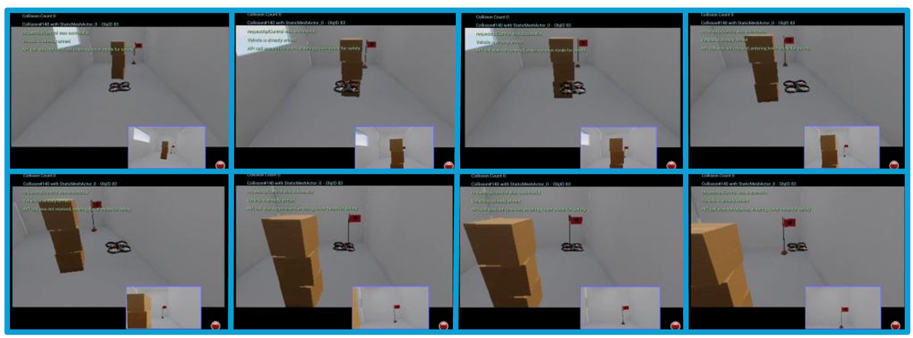

# AeroMind: PPO-based Indoor Drone Autonomy with AirSim
GPS 없는 실내 환경에서 AirSim(UE 4.27) 시뮬레이터를 사용해 카메라·LiDAR 융합 입력을 PPO 정책에 넣어 목표 추적/도달/장애물 회피를 수행하는 프로젝트입니다.  
YOLO(비전) + PointNet(LiDAR) 인코더로 멀티모달 특징을 추출해 Stable-Baselines3 PPO에 전달하며, UE에서 실행 중인 AirSim 인스턴스에 `main.py`로 바로 연결해 학습·테스트·수동 조종이 가능합니다.  
학습/테스트/수동 모드는 `config/config.py` 플래그로 전환하며, 가중치는 `weights/` 디렉터리를 사용합니다(대용량 파일은 미포함될 수 있음).  

## Quickstart (Windows / PowerShell)
1) **사전 준비**: Unreal Engine 4.27에서 AirSim 플러그인 맵을 열고 `Play` 상태 유지. AirSim `settings.json`에서 센서 이름이 `FrontCamera`, `LidarSensor1`과 일치하도록 설정.  
2) **Python**: 3.10 권장 (AirSim, Stable-Baselines3, Ultralytics 호환)  
3) **가상환경 생성**
   ```powershell
   python -m venv .venv
   .\.venv\Scripts\Activate.ps1
   ```
4) **필수 패키지 설치** 
   ```text
   airsim
   stable-baselines3
   torch
   torchvision
   gym==0.26.2
   numpy
   opencv-python
   keyboard
   matplotlib
   ultralytics
   ```
   ```powershell
   pip install -r requirements.txt
   ```
5) **실행 흐름**
   - UE4.27에서 AirSim 맵 `Play` 실행 유지
   - 새 PowerShell에서:
   ```powershell
   python main.py
   ```
   - 기본값은 `config/config.py`의 `TEST_MODE=True` → 테스트/재현 모드.  
   - 학습하려면 `TEST_MODE=False`, `MANUAL_OVERRIDING_MODE=False`로 설정.

## What Works
- PPO 에이전트로 목표 추적/도달/장애물 회피 시뮬레이션
- 카메라(ResNet18) + LiDAR(PointNet) 멀티모달 피처 추출 및 융합
- YOLO 기반 타깃 검출 정보를 정책/보상에 반영
- AirSim과 실시간 연동(이미지·LiDAR 수집, 드론 제어), 수동 개입 모드 지원
- 테스트 후 3D 궤적·보상 요약 시각화(`utils/callback.py`)

## Repository Structure
- `main.py` : 실행 엔트리. `TEST_MODE`/`MANUAL_OVERRIDING_MODE`에 따라 테스트, 수동 조종, 학습 분기.
- `envs/environment.py` : Gym 환경. AirSim 드론 제어, 관측(dict: LiDAR 포인트, 카메라 이미지, YOLO info, LiDAR polar feature), 보상 계산.
- `models/ppo.py` : PPO 학습/로딩 (`weights/ppo.zip`).
- `models/multiModalEncoder.py` : 커스텀 `BaseFeaturesExtractor`; ResNet18(카메라) + PointNet(LiDAR, `weights/global_feature_extractor.pth`) + YOLO 특성 결합.
- `models/globalFeatureExtractor.py` : PointNet 글로벌 피처 추출.
- `models/yolo.py` : Ultralytics YOLO 추론 래퍼. `model_path` 기본값은 로컬 절대경로이므로 환경에 맞게 수정 필요.
- `config/config.py` : 실행/센서/시뮬레이션 설정(카메라·LiDAR 이름, 시작/목표 좌표, 스텝 길이 등).
- `config/hyperparameter.py` : PPO 하이퍼파라미터 및 가중치 경로.
- `config/reward.py` : 보상 테이블.
- `config/key.py` : 수동 조종/종료 키 매핑.
- `utils/` : 로깅, LiDAR 폴라 피처 변환, 이미지 저장(`dataset/all_frames`), 수동 조종, 테스트 결과 시각화, 통계 계산 등.
- `test.py` : 학습된 모델 테스트 루프(자동/수동 전환 키 포함).
- `server.py` : TCP 영상 스트림 수신 예제(라즈베리파이 등).
- `weights/` : PPO/PointNet/YOLO 가중치 위치(대용량은 미포함 가능).
- `testCode/` : 인코더·YOLO 단위 테스트와 샘플 이미지.
- `dataset/all_frames/` : 실행 중 저장되는 프레임 기본 폴더.

## Training / Evaluation / Inference
- **모드 전환** (`config/config.py`)
  - 테스트: `TEST_MODE = True`
  - 수동 조종: `MANUAL_OVERRIDING_MODE = True`
  - 학습: `TEST_MODE = False`, `MANUAL_OVERRIDING_MODE = False`

- **학습**
  ```powershell
  # AirSim Play 상태에서
  python main.py
  ```
  - 하이퍼파라미터: `config/hyperparameter.py` (`PPO_N_STEPS`, `PPO_BATCH_SIZE`, `TOTAL_TIMESTEPS`, `MODEL_PATH_PPO` 등).
  - 멀티모달 피처 추출기는 `models/multiModalEncoder.py`에서 자동 적용.

- **테스트/평가**
  ```powershell
  # TEST_MODE=True
  python main.py
  ```
  - 학습된 `weights/ppo.zip`을 로드해 에피소드 반복(`config.TEST_MAX_EPISODES`, `TEST_EPISODE_STEPS`).
  - 결과: 3D 궤적 및 보상 통계 팝업(`utils/callback.py`).

- **수동 조종**
  ```powershell
  # MANUAL_OVERRIDING_MODE=True
  python main.py
  ```
  - 키 매핑(`config/key.py`): `w/s/a/d`(전/후/좌/우), `r/f`(상/하), `q/e`(좌/우 회전), `space`(상태 출력), `x` 종료.

- **추론 전제**
  - YOLO 가중치 경로(`models/yolo.py`의 `model_path`)와 PPO/PointNet 가중치가 필요.
  - 센서 이름·해상도가 AirSim `settings.json`과 `config/config.py` 일치해야 함 (`CAMERA_WIDTH=640`, `CAMERA_HEIGHT=480`, 채널 4).

## Unreal / AirSim Setup (재현)
- UE4.27에서 AirSim 플러그인 활성화 후 드론 모드로 `Play`.
- 예시 `Documents/AirSim/settings.json`
  ```json
  {
    "SettingsVersion": 1.2,
    "SimMode": "Multirotor",
    "Vehicles": {
      "Drone1": {
        "VehicleType": "SimpleFlight",
        "Cameras": {
          "FrontCamera": { "X": 0, "Y": 0, "Z": -1, "Pitch": 0, "Roll": 0, "Yaw": 0 }
        },
        "Sensors": {
          "LidarSensor1": {
            "SensorType": 6,
            "NumberOfChannels": 16,
            "PointsPerSecond": 100000,
            "Range": 20,
            "RotationsPerSecond": 10
          }
        }
      }
    }
  }
  ```
- 좌표계: AirSim 기본 NED(미터). `START_POS`, `TARGET_POS`도 미터 기준.
- 포트/호스트: 기본 AirSim 설정(127.0.0.1:41451) 사용.

## Pretrained Weights / Large Files
- GitHub 100MB 제한으로 학습된 가중치가 포함되지 않을 수 있음.
- 필요 파일:
  - `weights/ppo.zip` (PPO 정책)
  - `weights/global_feature_extractor.pth` (PointNet)
  - YOLO 가중치(`models/yolo.py`의 `model_path`, 환경에 맞게 수정)
- 배치 위치: `weights/` 폴더. 경로가 코드와 일치해야 로드됨.


## Demo (Video)
- 목표 추적: https://youtu.be/EeKbyxev2yI  
- 목표 도달: https://youtu.be/EdZQrPaHwNY  
- 장애물 회피 1: https://youtu.be/wVIOIzFpuGw  
- 장애물 회피 2: https://youtu.be/v0Tm_WT6zzE  
- 장애물 회피 3: https://youtu.be/ugyE5vjUI-E  

<br>

<p align="center">
  
</p>


## License / Acknowledgements
- Unreal Engine 4.27, Microsoft AirSim, Ultralytics YOLO, Stable-Baselines3, PyTorch/torchvision, OpenCV, Gym 등 외부 소프트웨어에 기반.
- 사용 기술: PPO, ResNet18 비전 인코더, PointNet LiDAR 인코더, YOLO 타깃 검출. 커리큘럼/도메인 랜덤화는 명시 설정은 없으며 맵·목표 조정으로 실험 가능.
- 라이선스 파일이 명시되어 있지 않으므로 활용 전에 프로젝트 정책을 확인하세요.

